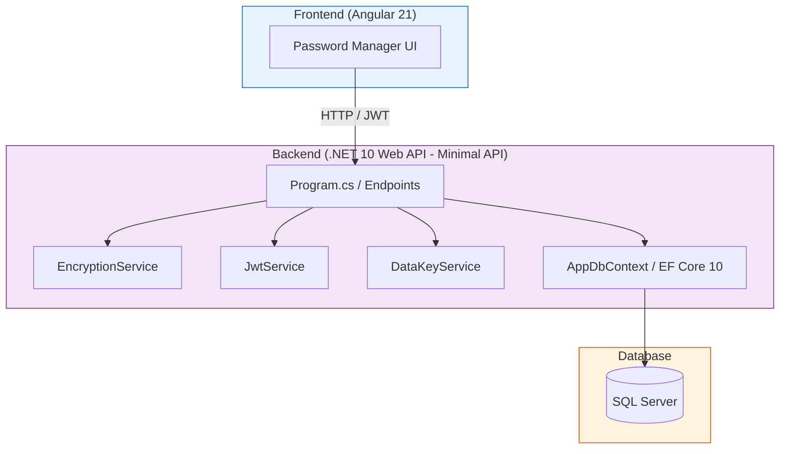
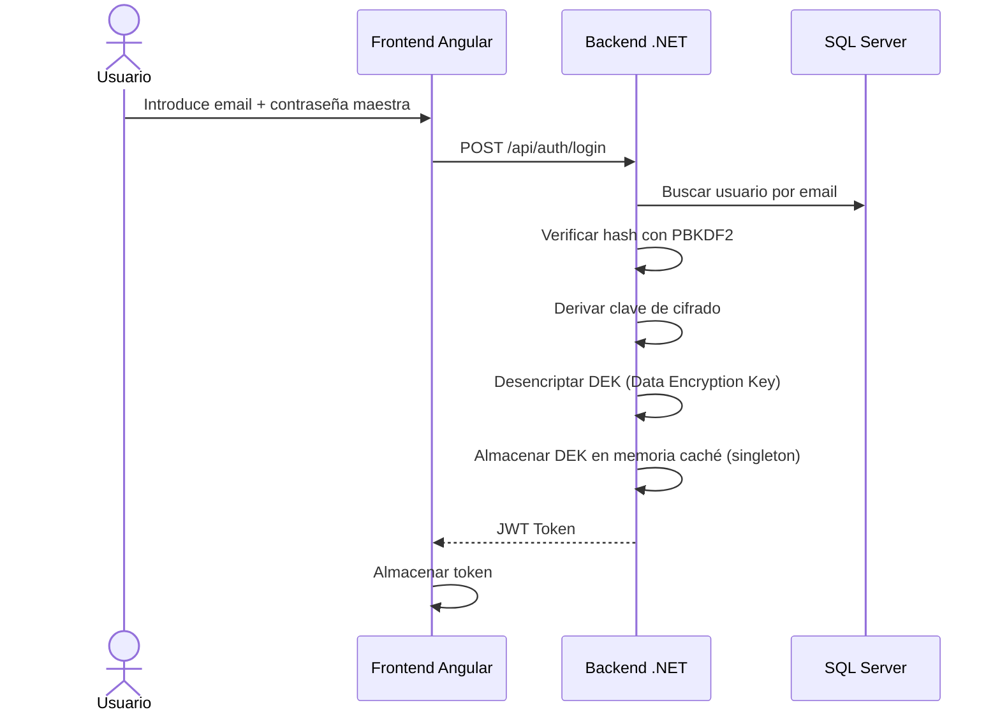
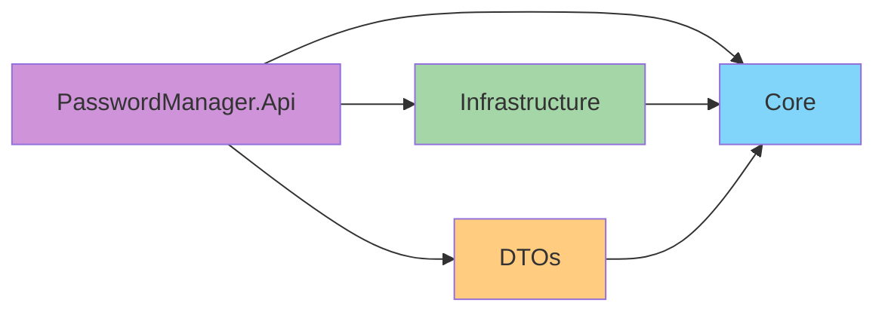

# PassHome — Gestor de Contraseñas

[](https://dotnet.microsoft.com/)
[](https://angular.dev/)
[](https://learn.microsoft.com/ef/core/)
[](LICENSE)

Aplicación full-stack para gestión segura de contraseñas personales. Las contraseñas se almacenan cifradas con AES-256-CBC y la clave de cifrado se deriva de la contraseña maestra del usuario mediante PBKDF2.

---

## Índice

- [Arquitectura](#arquitectura)
- [Stack Tecnológico](#stack-tecnológico)
- [Estructura del Proyecto](#estructura-del-proyecto)
- [Modelo de Seguridad](#modelo-de-seguridad)
- [Requisitos](#requisitos)
- [Cómo Empezar](#cómo-empezar)
  - [1. Base de datos (Docker)](#1-base-de-datos-docker)
  - [2. Backend](#2-backend)
  - [3. Frontend](#3-frontend)
- [API Reference](#api-reference)
- [Comandos Útiles](#comandos-útiles)
- [Desarrollo](#desarrollo)
  - [Migraciones](#migraciones)
  - [Testing](#testing)
- [Plan de Desarrollo](#plan-de-desarrollo)

---

## Arquitectura



### Diagrama de Flujo de Autenticación



---

## Stack Tecnológico

| Capa | Tecnología | Versión |
|------|-----------|---------|
| **Frontend** | Angular (standalone, zoneless) | 21.2 |
| **Backend** | .NET Web API (Minimal API) | 10.0 |
| **ORM** | Entity Framework Core | 10.0 |
| **Base de datos** | SQL Server | 2022 |
| **Autenticación** | JWT Bearer + PBKDF2 | — |
| **Cifrado** | AES-256-CBC | — |
| **Contenedores** | Docker | latest |
| **Lenguaje** | C# | 14 |
| **Runtime** | Node.js | 20 LTS |

---

## Estructura del Proyecto

```
passhome/
├── backend/
│   ├── PasswordManager.slnx              # Solution file (SLNX)
│   ├── PasswordManager.Api/              # Web API — Minimal API endpoints
│   │   ├── Program.cs                    # Configuración DI, endpoints, middleware
│   │   ├── appsettings.json              # Connection strings, JWT config
│   │   └── Properties/
│   │       └── launchSettings.json       # Perfiles de ejecución
│   ├── PasswordManager.Core/             # Dominio puro (sin dependencias externas)
│   │   ├── Entities/                     # User, PasswordEntry, Category
│   │   └── Interfaces/                   # Contratos de servicios
│   ├── PasswordManager.Infrastructure/   # Implementaciones concretas
│   │   ├── Data/
│   │   │   └── AppDbContext.cs           # DbContext de EF Core
│   │   ├── Services/                     # EncryptionService, JwtService, DataKeyService
│   │   └── Migrations/                   # Migraciones de EF Core
│   └── PasswordManager.DTOs/             # Records inmutables para API
│       ├── Auth/                         # Register/Login request + response
│       ├── Passwords/                    # CRUD DTOs + generate
│       └── Categories/                   # CRUD DTOs
├── frontend/                             # Angular 21 (próximamente)
├── docker-compose.yml                    # Orquestación (próximamente)
└── README.md
```

### Capas y Dependencias



| Proyecto | Responsabilidad | Dependencias |
|----------|----------------|--------------|
| `PasswordManager.Api` | Endpoints, middleware, DI | Core, Infrastructure, DTOs |
| `PasswordManager.Core` | Entidades, interfaces de servicio | *(ninguna)* |
| `PasswordManager.Infrastructure` | EF Core, servicios (cifrado, JWT, clave) | Core |
| `PasswordManager.DTOs` | Contratos de entrada/salida | Core |

---

## Modelo de Seguridad

### Esquema de Cifrado

| Componente | Algoritmo | Propósito |
|------------|-----------|-----------|
| **Hash de contraseña maestra** | PBKDF2-SHA256, 100k iteraciones | Autenticación del usuario |
| **DEK (Data Encryption Key)** | Random 256-bit | Cifrar/descifrar contraseñas almacenadas |
| **DEK cifrado** | AES-256-CBC | Almacenar la DEK en BD protegida por la clave maestra |
| **Contraseñas almacenadas** | AES-256-CBC (con IV único) | Cifrado individual por cada contraseña |

### Flujo de Registro

```
1. Cliente envía email + contraseña maestra
2. Servidor genera salt aleatorio (16 bytes)
3. Deriva clave de autenticación: PBKDF2(masterPassword, salt, 100k)
4. Genera DEK (Data Encryption Key) aleatoria de 256 bits
5. Deriva clave de cifrado para DEK: PBKDF2(masterPassword, salt, 100k)
6. Cifra DEK con AES-256 usando la clave derivada
7. Almacena en BD:
   - Email
   - Hash de autenticación (byte[])
   - Salt
   - DEK cifrada (byte[])
   - IV de la DEK (byte[])
```

### Flujo de Login

```
1. Cliente envía email + contraseña maestra
2. Servidor busca usuario por email
3. Deriva clave: PBKDF2(password, salt almacenado, 100k)
4. Compara con hash almacenado (constant-time comparison)
5. Si coincide:
   a. Deriva clave de cifrado con PBKDF2
   b. Descifra DEK almacenada
   c. Almacena DEK en memoria (ConcurrentDictionary)
   d. Devuelve JWT token (24h de validez)
```

---

## Requisitos

- [Docker Desktop](https://www.docker.com/products/docker-desktop/) (para SQL Server)
- [.NET SDK 10.0](https://dotnet.microsoft.com/download)
- [Node.js 20 LTS](https://nodejs.org/)
- [Angular CLI 21](https://angular.dev/tools/cli) (`npm install -g @angular/cli`)

---

## Cómo Empezar

### 1. Base de datos (Docker)

```powershell
# Arrancar SQL Server (solo la primera vez)
docker run -d `
  --name sqlserver `
  -e "ACCEPT_EULA=Y" `
  -e "MSSQL_SA_PASSWORD=Pass@word123" `
  -p 1433:1433 `
  -v sqlserver-data:/var/opt/mssql `
  mcr.microsoft.com/mssql/server:2022-latest

# Arrancar contenedor existente (después de reinicios)
docker start sqlserver

# Detener
docker stop sqlserver

# Eliminar (si quieres empezar de cero)
docker rm -v sqlserver
```

> **Nota**: El flag `-v sqlserver-data:/var/opt/mssql` crea un volumen persistente para que los datos no se pierdan al reiniciar el contenedor.

**Connection string** (ya configurada en `appsettings.json` para Docker):
```json
"Server=localhost,1433;Database=PasswordManager;User Id=sa;Password=Pass@word123;TrustServerCertificate=True"
```

### 2. Backend

```powershell
cd backend

# Instalar herramienta EF Core (si no la tienes)
dotnet tool install --global dotnet-ef

# Restaurar paquetes
dotnet restore

# Crear migración inicial
dotnet ef migrations add InitialCreate `
  --project PasswordManager.Infrastructure `
  --startup-project PasswordManager.Api

# Aplicar migraciones a la BD
dotnet ef database update `
  --project PasswordManager.Infrastructure `
  --startup-project PasswordManager.Api

# Ejecutar servidor de desarrollo
dotnet run --project PasswordManager.Api
```

La API estará disponible en:
- HTTP:  `http://localhost:5249`
- HTTPS: `https://localhost:7052`

### 3. Frontend

*(Por implementar — Fase 2)*

---

## API Reference

### Autenticación

#### `POST /api/auth/register`

Registra un nuevo usuario.

**Request:**
```json
{
  "email": "usuario@ejemplo.com",
  "masterPassword": "MiClaveMaestra123"
}
```

**Response (200):**
```json
{
  "id": 1,
  "email": "usuario@ejemplo.com"
}
```

**Errors:**
| Código | Causa |
|--------|-------|
| `409 Conflict` | El email ya está registrado |

---

#### `POST /api/auth/login`

Inicia sesión y devuelve un JWT.

**Request:**
```json
{
  "email": "usuario@ejemplo.com",
  "masterPassword": "MiClaveMaestra123"
}
```

**Response (200):**
```json
{
  "token": "eyJhbGciOiJIUzI1NiIs...",
  "expiration": "2026-07-30T16:00:00Z"
}
```

**Errors:**
| Código | Causa |
|--------|-------|
| `401 Unauthorized` | Credenciales inválidas |

---

### Contraseñas (requieren JWT)

Todas las rutas requieren el header:
```
Authorization: Bearer <token>
```

#### `GET /api/passwords`

Lista todas las contraseñas del usuario (descifradas en memoria).

**Response (200):**
```json
[
  {
    "id": 1,
    "title": "Netflix",
    "username": "carlos@email.com",
    "decryptedPassword": "Netflix2026!",
    "url": "https://netflix.com",
    "categoryId": 1,
    "categoryName": "Streaming",
    "notes": "Cuenta familiar",
    "createdAt": "2026-07-28T15:00:00Z",
    "updatedAt": "2026-07-28T15:00:00Z"
  }
]
```

---

#### `POST /api/passwords`

Crea una nueva contraseña.

**Request:**
```json
{
  "title": "Netflix",
  "username": "carlos@email.com",
  "password": "Netflix2026!",
  "url": "https://netflix.com",
  "categoryId": 1,
  "notes": "Cuenta familiar"
}
```

**Response (201):**
```json
{
  "id": 1
}
```

---

#### `PUT /api/passwords/{id}`

Actualiza una contraseña existente.

**Request:**
```json
{
  "title": "Netflix",
  "username": "carlos@email.com",
  "password": "Netflix2027!",  // opcional: si se omite, no se modifica
  "url": "https://netflix.com",
  "categoryId": 1,
  "notes": "Actualizada"
}
```

**Response (200):**
```json
{
  "id": 1
}
```

---

#### `DELETE /api/passwords/{id}`

Elimina una contraseña.

**Response:** `204 No Content`

---

#### `GET /api/passwords/generate`

Genera una contraseña aleatoria.

**Query parameters (todos opcionales):**
| Parámetro | Tipo | Default | Descripción |
|-----------|------|---------|-------------|
| `length` | int | 16 | Longitud de la contraseña |
| `includeUpper` | bool | true | Incluir mayúsculas |
| `includeLower` | bool | true | Incluir minúsculas |
| `includeNumbers` | bool | true | Incluir números |
| `includeSymbols` | bool | true | Incluir símbolos |

**Response (200):**
```json
{
  "password": "aB3#kL9$xR7@pQ2!"
}
```

---

### Categorías (requieren JWT)

#### `GET /api/categories`

Lista las categorías del usuario.

**Response (200):**
```json
[
  {
    "id": 1,
    "name": "Streaming",
    "icon": "tv"
  }
]
```

---

#### `POST /api/categories`

Crea una categoría.

**Request:**
```json
{
  "name": "Streaming",
  "icon": "tv"
}
```

**Response (201):**
```json
{
  "id": 1,
  "name": "Streaming",
  "icon": "tv"
}
```

---

#### `DELETE /api/categories/{id}`

Elimina una categoría. Las contraseñas asociadas pasan a tener `categoryId = null`.

**Response:** `204 No Content`

---

## Comandos Útiles

### Docker

```powershell
# Ver contenedores activos
docker ps

# Ver todos los contenedores (incluyendo detenidos)
docker ps -a

# Ver logs de SQL Server
docker logs sqlserver

# Entrar al contenedor
docker exec -it sqlserver /opt/mssql-tools/bin/sqlcmd -S localhost -U sa -P "Pass@word123"
```

### .NET / EF Core

```powershell
# Listar migraciones
dotnet ef migrations list --project PasswordManager.Infrastructure --startup-project PasswordManager.Api

# Crear nueva migración
dotnet ef migrations add NombreMigracion --project PasswordManager.Infrastructure --startup-project PasswordManager.Api

# Revertir migración
dotnet ef database update NombreMigracionAnterior --project PasswordManager.Infrastructure --startup-project PasswordManager.Api

# Eliminar última migración (sin aplicar)
dotnet ef migrations remove --project PasswordManager.Infrastructure --startup-project PasswordManager.Api

# Generar script SQL
dotnet ef migrations script --project PasswordManager.Infrastructure --startup-project PasswordManager.Api

# Compilar
dotnet build

# Ejecutar tests
dotnet test
```

---

## Desarrollo

### Migraciones

Las migraciones de EF Core se crean desde `PasswordManager.Api` porque es el proyecto de inicio, pero el contexto (`AppDbContext`) está en `PasswordManager.Infrastructure`.

```powershell
# Crear: dotnet ef migrations add <Nombre> --project <DbContext> --startup-project <Startup>
dotnet ef migrations add AgregarCampoFavorito --project PasswordManager.Infrastructure --startup-project PasswordManager.Api

# Aplicar
dotnet ef database update --project PasswordManager.Infrastructure --startup-project PasswordManager.Api
```

### Testing

*(Por implementar)*

### Convenciones de Código

- **Proyectos**: 4 capas (Api → Core + Infrastructure + DTOs)
- **C#**: Target-typed `new`, collection expressions (`[]`), `Primary Constructors` en `record`
- **Naming**: `PascalCase` para clases/métodos, `camelCase` para parámetros/locales
- **DTOs**: `record` inmutables
- **Endpoints**: Minimal API (sin controllers)
- **DI**: Inyección de dependencias nativa

---

## Plan de Desarrollo

| Fase | Descripción | Estado |
|------|-------------|--------|
| **Fase 1** | Backend .NET 10 (auth, CRUD, cifrado) | ✅ Completado |
| **Fase 2** | Frontend Angular 21 (login, dashboard) | ⏳ Pendiente |
| **Fase 3** | Features extra (generador, búsqueda, import/export) | ⏳ Pendiente |
| **Fase 4** | DevOps (Docker compose, Azure) | ⏳ Pendiente |

---

## Licencia

MIT License — ver [LICENSE](LICENSE) para más detalles.
