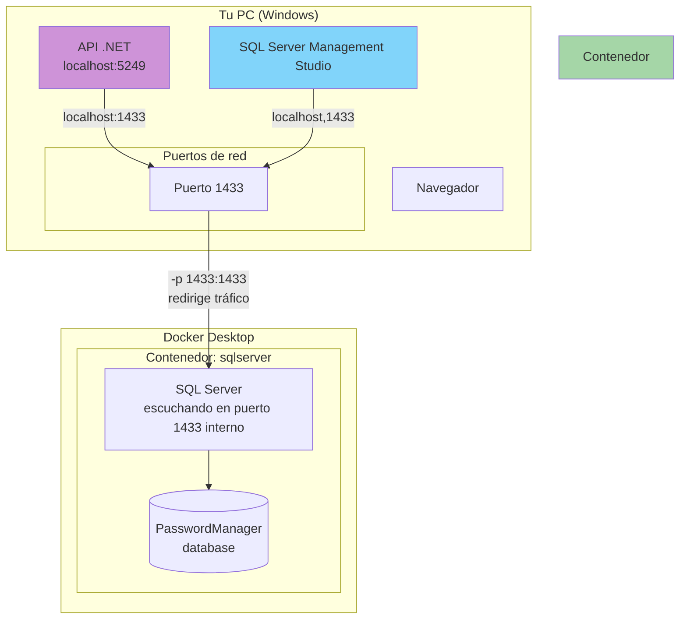
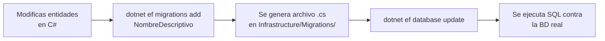

# Guía de Docker, Base de Datos y Migraciones

## Índice

1. [¿Cómo funciona Docker con SQL Server?](#1-cómo-funciona-docker-con-sql-server)
2. [Comandos esenciales de Docker](#2-comandos-esenciales-de-docker)
3. [Connection Strings y Configuración](#3-connection-strings-y-configuración)
4. [Migraciones de Entity Framework Core](#4-migraciones-de-entity-framework-core)
5. [Flujo de trabajo diario](#5-flujo-de-trabajo-diario)
6. [Solución de problemas comunes](#6-solución-de-problemas-comunes)
7. [Referencia rápida de comandos](#7-referencia-rápida-de-comandos)

---

## 1. ¿Cómo funciona Docker con SQL Server?

### Concepto: Mapeo de Puertos

Cuando ejecutas SQL Server dentro de Docker, el servidor no está instalado directamente en Windows. Está corriendo dentro de un contenedor aislado. Para que las aplicaciones de Windows (como nuestra API .NET o SSMS) puedan conectarse, necesitas **mapear un puerto**.



### El mapeo de puertos: `-p 1433:1433`

Este es el comando clave que hace posible la comunicación. Vamos a desglosarlo:

```powershell
-p 1433:1433
```

```
  ┌───────┐   ┌───────┐
  │ 1433  │ : │ 1433  │
  └───┬───┘   └───┬───┘
      │           │
      │           └── Puerto DENTRO del contenedor
      │               (SQL Server escucha aquí)
      │
      └── Puerto del HOST (tu Windows)
          (tu API/SSMS se conectan aquí)
```

**Lado izquierdo** (`1433` antes de los dos puntos) → el puerto de **Windows**.  
**Lado derecho** (`1433` después de los dos puntos) → el puerto **dentro del contenedor**.

Tu API .NET y SSMS se conectan a `localhost,1433` (tu Windows), y Docker redirige ese tráfico al puerto 1433 dentro del contenedor donde SQL Server está escuchando.

> Puedes cambiarlos: `-p 3333:1433` haría que te conectases a `localhost,3333`. El derecho **siempre debe ser 1433** porque ahí escucha SQL Server dentro del contenedor.

### La analogía del enchufe

Imagina que:

- **SQL Server** es un dispositivo (ej: un cargador) que necesita un enchufe para funcionar.
- **El puerto 1433 de Windows** es un enchufe físico en tu pared.
- **Docker** es una regleta con interruptor.
- **`-p 1433:1433`** es el cable que conecta el enchufe de la pared a la regleta.

```
┌─────────────────────────────────────┐
│            Windows                  │
│  ┌──────────┐    ┌───────────────┐  │
│  │ Enchufe  │────│   Regleta     │  │
│  │ (puerto  │    │   (Docker)    │  │
│  │  1433)   │    │   ┌─────────┐ │  │
│  └──────────┘    │   │ SQL Svr │ │  │
│                  │   └─────────┘ │  │
│                  │   ↑───────────┘  │
│                  │   interruptor    │
│                  └───────────────┘  │
└─────────────────────────────────────┘
```

| Estado | Qué pasa |
|--------|----------|
| `docker start sqlserver` | El interruptor está ON → corriente fluye → SQL Server funciona → puerto 1433 responde |
| `docker stop sqlserver` | El interruptor está OFF → no hay corriente → el puerto 1433 no responde → "connection refused" |
| `docker rm sqlserver` | Desconectas la regleta y la tiras → pierdes los datos (a menos que tengas volumen) |

### Persistencia de datos con volúmenes

Cuando creaste el contenedor con `-v sqlserver-data:/var/opt/mssql`, le dijiste a Docker:

> "Los archivos de base de datos que SQL Server guarda en `/var/opt/mssql` (dentro del contenedor), en realidad guárdalos en una carpeta especial de Docker llamada `sqlserver-data` (en tu disco duro)."

Esto significa que aunque **detengas el contenedor** o incluso lo **borres y crees uno nuevo**, los datos siguen ahí porque están en tu disco, no dentro del contenedor.

```
Tu disco duro (Windows)
│
├── C:\Users\carlo\...
├── C:\Program Files\...
└── Docker volumes (gestionado por Docker Desktop)
    └── sqlserver-data          ← aquí están realmente los .mdf y .ldf
            └── /var/opt/mssql  ← esto es lo que ve SQL Server dentro del contenedor
```

---

## 2. Comandos esenciales de Docker

### Comando completo (solo la primera vez)

```powershell
docker run -d `
  --name sqlserver `
  -e "ACCEPT_EULA=Y" `
  -e "MSSQL_SA_PASSWORD=<TU_CONTRASEÑA>" `
  -p 1433:1433 `
  -v sqlserver-data:/var/opt/mssql `
  mcr.microsoft.com/mssql/server:2022-latest
```

Este comando **crea y arranca** el contenedor. Es la **primera y única vez** que lo ejecutas. A partir de ahí usas `docker start/stop sqlserver`.

Para copiar y pegar directamente en PowerShell (todo en una línea):

```powershell
docker run -d --name sqlserver -e "ACCEPT_EULA=Y" -e "MSSQL_SA_PASSWORD=<TU_CONTRASEÑA>" -p 1433:1433 -v sqlserver-data:/var/opt/mssql mcr.microsoft.com/mssql/server:2022-latest
```

| Parámetro | Significado |
|-----------|-------------|
| `-d` | Detached — ejecuta en segundo plano |
| `--name sqlserver` | Nombre del contenedor para referirnos a él |
| `-e "ACCEPT_EULA=Y"` | Aceptas la licencia de Microsoft (obligatorio) |
| `-e "MSSQL_SA_PASSWORD=<TU_CONTRASEÑA>"` | Contraseña del usuario `sa` (admin) |
| `-p 1433:1433` | Mapea el puerto 1433 de Windows → 1433 del contenedor |
| `-v sqlserver-data:/var/opt/mssql` | Volumen persistente para los datos |
| `mcr.microsoft.com/mssql/server:2022-latest` | La imagen de SQL Server |

### Día a día

```powershell
# Arrancar SQL Server (después de reiniciar el PC o tras un stop)
docker start sqlserver

# Verificar que está corriendo
docker ps

# Parar SQL Server (libera recursos)
docker stop sqlserver

# Ver logs
docker logs sqlserver
```

### Gestión de contenedores

```powershell
# Listar contenedores activos
docker ps

# Listar todos (incluyendo detenidos)
docker ps -a

# Parar
docker stop sqlserver

# Arrancar
docker start sqlserver

# Reiniciar
docker restart sqlserver

# Eliminar (borra el contenedor, pero NO los datos si tienes volumen)
docker rm sqlserver

# Eliminar contenedor + sus volúmenes (CUIDADO: borra datos)
docker rm -v sqlserver
```

### Consola interactiva dentro de SQL Server

```powershell
docker exec -it sqlserver /opt/mssql-tools/bin/sqlcmd -S localhost -U sa -P "<TU_CONTRASEÑA>"
```

Una vez dentro puedes ejecutar SQL directamente:
```sql
SELECT name FROM sys.databases;
GO
USE PasswordManager;
GO
SELECT * FROM Users;
GO
```

Para salir: escribe `exit` y pulsa Enter.

---

## 3. Connection Strings y Configuración

### Para Docker (SQL Server en contenedor)

```json
"DefaultConnection": "Server=localhost,1433;Database=PasswordManager;User Id=sa;Password=<TU_CONTRASEÑA>;TrustServerCertificate=True"
```

Desglose:

| Parte | Significado |
|-------|-------------|
| `Server=localhost,1433` | Servidor en local, puerto 1433 (el mapeado a Docker) |
| `Database=PasswordManager` | Nombre de la BD (EF Core la crea automáticamente) |
| `User Id=sa` | Usuario administrador de SQL Server |
| `Password=<TU_CONTRASEÑA>` | La contraseña que pusiste al crear el contenedor |
| `TrustServerCertificate=True` | Acepta el certificado SSL auto-firmado (entorno local) |

### Para SQL Server Express local (sin Docker)

```json
"DefaultConnection": "Server=localhost;Database=PasswordManager;Trusted_Connection=True;TrustServerCertificate=True"
```

> **Diferencia clave**: Con Docker usas `sa` + contraseña (autenticación SQL). Con SQL local usas `Trusted_Connection=True` (autenticación Windows — tu usuario de Windows).

### Dónde se configura

Archivo: `backend\PasswordManager.Api\appsettings.json`

---

## 4. Migraciones de Entity Framework Core

### ¿Qué es una migración?

Es una clase en C# que EF Core genera automáticamente al comparar tus entidades (`User.cs`, `PasswordEntry.cs`, `Category.cs`) con el esquema actual de la base de datos. Contiene el `Up()` (crear/modificar tablas) y `Down()` (revertir cambios).

### Flujo de trabajo



### Comandos

```powershell
# Asegúrate de estar en la carpeta backend/
cd backend

# 1. CREAR una migración
dotnet ef migrations add NombreAqui `
  --project PasswordManager.Infrastructure `
  --startup-project PasswordManager.Api

# 2. APLICAR migraciones a la BD
dotnet ef database update `
  --project PasswordManager.Infrastructure `
  --startup-project PasswordManager.Api

# 3. LISTAR migraciones existentes
dotnet ef migrations list `
  --project PasswordManager.Infrastructure `
  --startup-project PasswordManager.Api

# 4. REVERTIR a una migración anterior
dotnet ef database update NombreMigracionAnterior `
  --project PasswordManager.Infrastructure `
  --startup-project PasswordManager.Api

# 5. ELIMINAR la última migración (solo si no se ha aplicado)
dotnet ef migrations remove `
  --project PasswordManager.Infrastructure `
  --startup-project PasswordManager.Api

# 6. GENERAR script SQL (para revisión o deploy manual)
dotnet ef migrations script `
  --project PasswordManager.Infrastructure `
  --startup-project PasswordManager.Api
```

### ¿Por qué dos proyectos?

| Parámetro | Proyecto | Contiene |
|-----------|----------|----------|
| `--project` | `PasswordManager.Infrastructure` | El `AppDbContext` (las entidades, las configuraciones) |
| `--startup-project` | `PasswordManager.Api` | El `Program.cs` con la connection string y la DI |

EF Core necesita ambos: el contexto para saber qué tablas crear, y el proyecto de inicio para saber a qué BD conectarse.

---

## 5. Flujo de trabajo diario

### Escenario 1: Acabas de encender el PC

```powershell
# 1. Arrancar Docker (si no arranca solo)
#    - Abre Docker Desktop manualmente o ejecuta:
& "C:\Program Files\Docker\Docker\Docker Desktop.exe"

# 2. Arrancar SQL Server
docker start sqlserver

# 3. Arrancar la API
dotnet run --project backend\PasswordManager.Api
```

### Escenario 2: Cambiaste una entidad (ej: añadiste un campo)

```powershell
# 1. Detener la API (Ctrl + C en la terminal donde corría)

# 2. Crear migración
dotnet ef migrations add AgregarCampoX `
  --project backend\PasswordManager.Infrastructure `
  --startup-project backend\PasswordManager.Api

# 3. Aplicar
dotnet ef database update `
  --project backend\PasswordManager.Infrastructure `
  --startup-project backend\PasswordManager.Api

# 4. Volver a ejecutar
dotnet run --project backend\PasswordManager.Api
```

### Escenario 3: Quieres empezar de cero (reset completo)

```powershell
# 1. Eliminar BD
docker exec -it sqlserver /opt/mssql-tools/bin/sqlcmd -S localhost -U sa -P "<TU_CONTRASEÑA>" -Q "DROP DATABASE PasswordManager"

# 2. Eliminar migraciones
dotnet ef migrations remove `
  --project backend\PasswordManager.Infrastructure `
  --startup-project backend\PasswordManager.Api

# 3. Crear migración desde cero
dotnet ef migrations add InitialCreate `
  --project backend\PasswordManager.Infrastructure `
  --startup-project backend\PasswordManager.Api

# 4. Aplicar
dotnet ef database update `
  --project backend\PasswordManager.Infrastructure `
  --startup-project backend\PasswordManager.Api
```

O más drástico (borra contenedor y volumen):
```powershell
docker stop sqlserver
docker rm -v sqlserver
# Y luego crea el contenedor de nuevo (ver sección 2)
```

---

## 6. Solución de problemas comunes

### "Cannot connect to localhost,1433"

```powershell
# 1. ¿El contenedor está corriendo?
docker ps
# Debe aparecer "sqlserver" con estado "Up"

# 2. Si no aparece:
docker start sqlserver

# 3. Si aparece pero no conecta, revisa logs:
docker logs sqlserver
```

### "Introducing FOREIGN KEY constraint may cause cycles or multiple cascade paths"

Error típico de SQL Server. Solución: cambiar `OnDelete(DeleteBehavior.Cascade)` por `OnDelete(DeleteBehavior.NoAction)` en alguna de las relaciones. Luego eliminar la migración y crear una nueva.

```powershell
dotnet ef migrations remove --project PasswordManager.Infrastructure --startup-project PasswordManager.Api
# (editar AppDbContext.cs)
dotnet ef migrations add InitialCreate --project PasswordManager.Infrastructure --startup-project PasswordManager.Api
dotnet ef database update --project PasswordManager.Infrastructure --startup-project PasswordManager.Api
```

### El contenedor se creó sin volumen y perdí datos al reiniciar

Si ejecutaste el `docker run` sin `-v sqlserver-data:/var/opt/mssql`, los datos se pierden al hacer `docker rm`. Para evitarlo a futuro:

```powershell
docker stop sqlserver
docker rm sqlserver
docker run -d --name sqlserver -e "ACCEPT_EULA=Y" -e "MSSQL_SA_PASSWORD=<TU_CONTRASEÑA>" -p 1433:1433 -v sqlserver-data:/var/opt/mssql mcr.microsoft.com/mssql/server:2022-latest
```

Y luego vuelve a aplicar las migraciones (`dotnet ef database update`).

### "Port 1433 is already allocated"

Otro contenedor o programa está usando el puerto 1433. Comprueba:

```powershell
# Qué está usando el puerto 1433
netstat -ano | findstr :1433

# Si es otro contenedor Docker:
docker ps
# Si ves otro contenedor con el mismo nombre/puerto, páralo y bórralo
docker stop nombre-container
docker rm nombre-container
```

---

## 7. Referencia rápida de comandos

### Docker

| Acción | Comando |
|--------|---------|
| Crear contenedor | `docker run -d --name sqlserver -e "ACCEPT_EULA=Y" -e "MSSQL_SA_PASSWORD=<TU_CONTRASEÑA>" -p 1433:1433 -v sqlserver-data:/var/opt/mssql mcr.microsoft.com/mssql/server:2022-latest` |
| Arrancar | `docker start sqlserver` |
| Parar | `docker stop sqlserver` |
| Ver estado | `docker ps` |
| Ver logs | `docker logs sqlserver` |
| Consola SQL | `docker exec -it sqlserver /opt/mssql-tools/bin/sqlcmd -S localhost -U sa -P "<TU_CONTRASEÑA>"` |
| Eliminar contenedor | `docker rm sqlserver` |
| Eliminar contenedor + datos | `docker rm -v sqlserver` |

### EF Core Migrations

*(Ejecutar desde la carpeta `backend/`)*

| Acción | Comando |
|--------|---------|
| Crear migración | `dotnet ef migrations add Nombre --project PasswordManager.Infrastructure --startup-project PasswordManager.Api` |
| Aplicar | `dotnet ef database update --project PasswordManager.Infrastructure --startup-project PasswordManager.Api` |
| Listar | `dotnet ef migrations list --project PasswordManager.Infrastructure --startup-project PasswordManager.Api` |
| Revertir | `dotnet ef database update NombreAnterior --project PasswordManager.Infrastructure --startup-project PasswordManager.Api` |
| Eliminar última | `dotnet ef migrations remove --project PasswordManager.Infrastructure --startup-project PasswordManager.Api` |
| Generar script SQL | `dotnet ef migrations script --project PasswordManager.Infrastructure --startup-project PasswordManager.Api` |

### .NET

| Acción | Comando |
|--------|---------|
| Compilar | `dotnet build` (desde `backend/`) |
| Ejecutar API | `dotnet run --project PasswordManager.Api` |
| Restaurar paquetes | `dotnet restore` |
| Ver paquetes vulnerables | `dotnet list package --vulnerable` |
| Ver versiones | `dotnet --version` / `ng version` |

---

> **Documentación generada para PassHome — Gestor de Contraseñas**
